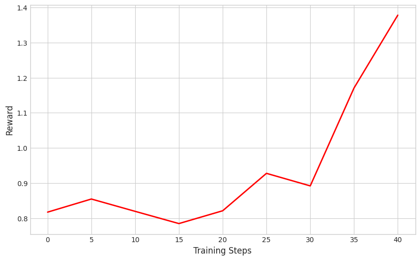

# 🚀 Game_GRPO: Training an LLM Agent for 2048

This repo contains a simple, from-scratch GRPO implementation to train an LLM agent to play **2048**. The focus is training via multi-turn interaction (board → move → new board → …). No dependency on `vLLM` or `verl`.


## Training 

We train from the model `Qwen2.5-3B-Instruct`:

```
bash train.sh
```

## Results

Training on 4 episodes within one group (all starting from the same initial game) shows a clear increase in reward:




## Demo

A short demo of our trained LLM agent playing 2048:
[**view the game log**](demo/game_log.pdf).


## Acknowledgements
- [Agent Reinforcement Trainer (ART)](https://github.com/OpenPipe/ART/tree/2d573f85a5b0d0e37c5add3d380e84317e6ca0c4) — 2048 environment setup.
- [GRPO-Zero](https://github.com/policy-gradient/GRPO-Zero/tree/main) — reference GRPO implementation.
- [RLFromScratch](https://github.com/mingyin0312/RLFromScratch/tree/main) — reference GRPO implementation.

